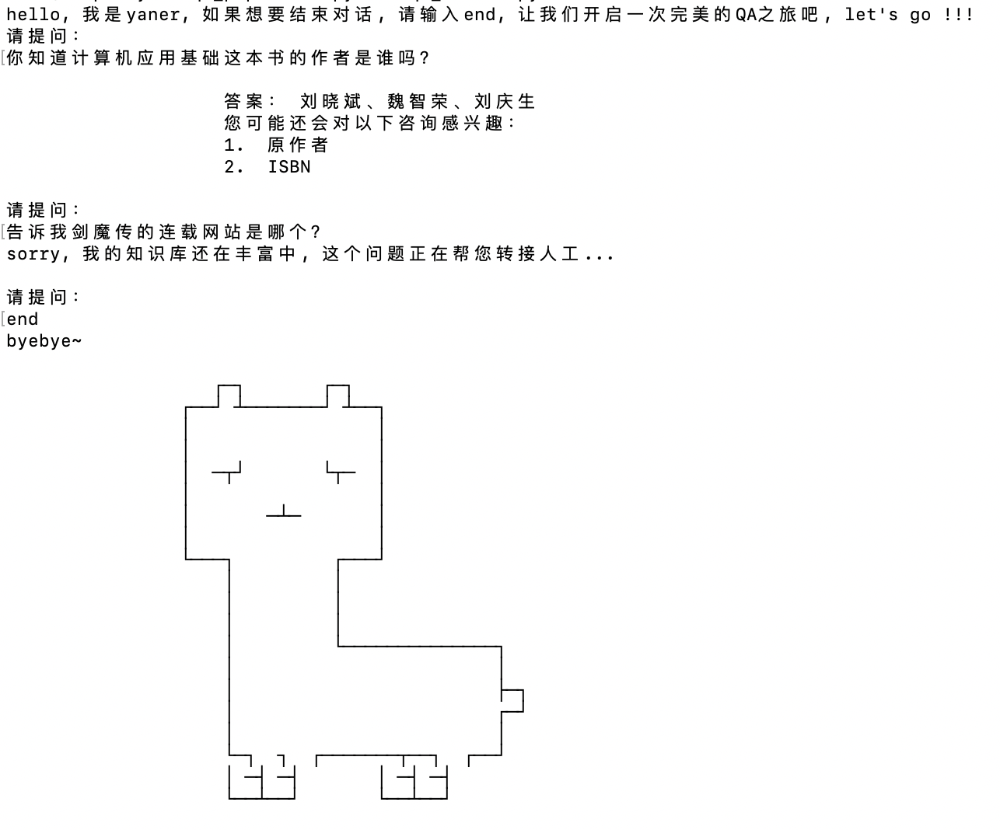

# KBQA_zh
基于bert的KBQA，包含joint和pipeline两种模式

### Introduction
本项目是一个基于知识三元组的简单的问答系统，分为joint和pipeline两种模式。joint模式为基于bert做意图识别和命名体识别的联合学习训练得到的模型，pipeline模式为单独训练命名实体识别和QA相似度模型。

### Environment
tensorflow 1.15     
python 3.6      
pymysql 0.10.1       
grpcio 1.32.0     
grpcio-tools 1.32.0      

### How to run
首先需要下载bert的中文预训练模型放在chinese_L-12_H-768_A-12文件夹下，[下载地址](https://storage.googleapis.com/bert_models/2018_11_03/chinese_L-12_H-768_A-12.zip) 
然后，以pipeline模式为例，执行如下命令，训练命名实体识别模型和问答模型：
`1. cd qa_pipeline
 2. sh run_ner.sh
 3. sh run_qa.sh`

然后，退回到KGMySql.py文件所在目录，在终端中输入python KGMySql.py，将三元组存储到你的mysql数据库， 
接着，在终端中输入以下命令：
`1. cd qa_pipeline`
`2. python qa_server.py`
`3. 开启一个新的终端，切换到qa_pipeline目录下，执行python qa_client.py，然后就可以开启一次完美的QA之旅了O(∩_∩)O~~`

如果想到其他主机上运行客户端，只需要将qa_client.py和qa_pipeline.proto两个文件copy到对应主机，然后开启终端切换到存放两个文件的目录下，运行如下命令(如果没有安装grpc，请先pip install grpcio和grpcio-tools)： 

`python -m grpc_tools.protoc -I./ --python_out=./ --grpc_python_out=./ ./qa_pipeline.proto `

然后将qa_client.py文件中请求的IP，改为提供服务的主机的IP即可(运行着qa_server.py程序的主机的IP)。

进一步，如果想用他语言开发客户端，主需要按qa_pipeline.proto的协议，基于grpc开发相应语言的客户端即可。

joint模式的运行方式同上。

### Effect

### Expectation
由于命名实体数据标注的准确性比较差，基于bert的联合学习效果并不是很理想，接下来会提升标注数据的准确性，以提升模型的效果，也会进一步开发前端页面，以提供能更好的可视化效果。
